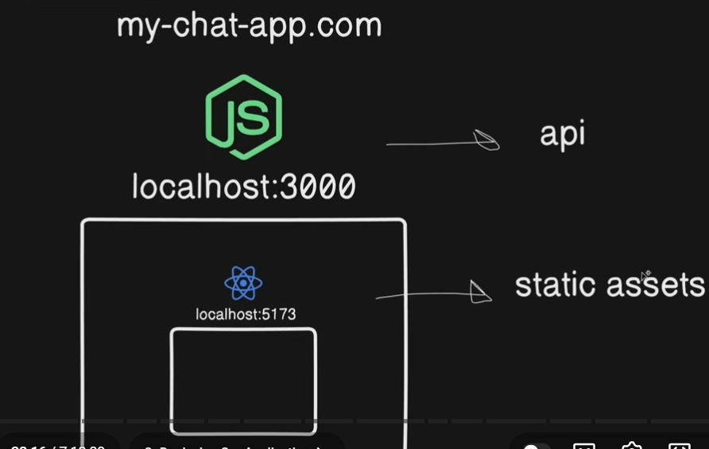

Architecture: a **monorepo architecture**, in which the backend and frontend is managed in the same repositories.

we are serving our frontend from backend only under one single domain instead using two seperate servers/urls for both projects.

we can serve our frontend as well as we can access out backend apis from the single domain at different routes.

ex: at localhost:3000: we are serving our frontend.   at localhost:3000/api/auth: we are serving our backend apis for auth under same domain/url i.e localhost:3000.

tools and technologies

Backend

* Node.js
* Express.js
* MongoDB: database
* Socket.io: for realtime features
* Resend: to send emails
* Arcjet: for rate limiting
* JWT: authentication
* Cloudinary: image uploads

Frontend

* React.js
* Tailwind and DaisyUI: styling
* Zustand: state management.
